# REBY — Database Design (ERD)

Fashion e-commerce backend · PostgreSQL · single-store, customer + staff access levels.
Source of truth for the schema is [schema.prisma](schema.prisma); this document is a human-readable companion.

## Entity-Relationship Diagram

```mermaid
erDiagram
    USER ||--o{ ADDRESS : has
    USER ||--o| CART : owns
    USER ||--o| WISHLIST : owns
    USER ||--o{ ORDER : places
    USER ||--o{ NOTIFICATION : receives
    USER ||--o{ RECENTLY_VIEWED : views
    USER ||--o{ REFRESH_TOKEN : "session for"

    STAFF_PROFILE ||--o{ ORDER_STATUS_HISTORY : records
    STAFF_PROFILE ||--o{ REFUND_REQUEST : reviews
    STAFF_PROFILE ||--o{ REFRESH_TOKEN : "session for"

    CATEGORY ||--o{ CATEGORY : "parent/child"
    CATEGORY ||--o{ PRODUCT : classifies

    PRODUCT ||--o{ PRODUCT_IMAGE : has
    PRODUCT ||--o{ PRODUCT_VARIANT : has
    PRODUCT ||--o{ COLLECTION_PRODUCT : "in"
    PRODUCT ||--o{ CART_ITEM : "in"
    PRODUCT ||--o{ WISHLIST_ITEM : "in"
    PRODUCT ||--o{ RECENTLY_VIEWED : "viewed as"

    COLLECTION ||--o{ COLLECTION_PRODUCT : contains

    PRODUCT_VARIANT ||--o{ CART_ITEM : "selected as"
    PRODUCT_VARIANT ||--o{ WISHLIST_ITEM : "selected as"
    PRODUCT_VARIANT ||--o{ ORDER_ITEM : "sold as"

    CART ||--o{ CART_ITEM : contains
    CART }o--o| COUPON : applies

    WISHLIST ||--o{ WISHLIST_ITEM : contains

    ADDRESS ||--o{ ORDER : "ships to"

    ORDER ||--o{ ORDER_ITEM : contains
    ORDER ||--o| PAYMENT : "paid by"
    ORDER ||--o{ ORDER_STATUS_HISTORY : logs
    ORDER ||--o{ REFUND : has
    ORDER ||--o{ REFUND_REQUEST : has
    ORDER }o--o| COUPON : applies

    USER {
        string id PK
        string name
        string email UK
        string passwordHash
        string phone
        boolean notificationsEnabled
        string deviceToken
        int failedLoginAttempts
        datetime lockedUntil
        datetime deletedAt
    }

    STAFF_PROFILE {
        string id PK
        string name
        string email UK
        string passwordHash
        enum role "staff | manager | owner"
        boolean isActive
        int failedLoginAttempts
        datetime lockedUntil
    }

    REFRESH_TOKEN {
        string id PK
        string tokenHash UK "SHA-256 of the opaque raw token; raw value never stored"
        string tokenType "customer | staff"
        string userId FK "exactly one of userId/staffId set (DB CHECK)"
        string staffId FK
        datetime expiresAt
        datetime revokedAt
        string replacedByTokenHash "set on rotation"
        string ipAddress
        string userAgent
    }

    ADDRESS {
        string id PK
        string userId FK
        string label
        string recipientName
        string phone
        string province
        string district
        string sector
        string street
        boolean isDefault
    }

    CATEGORY {
        string id PK
        string parentId FK "self-relation"
        string name
        string slug UK
        string imageUrl
        int sortOrder
        boolean isActive
    }

    COLLECTION {
        string id PK
        string name
        string slug UK
        string description
        boolean isActive
        datetime startsAt
        datetime endsAt
    }

    COLLECTION_PRODUCT {
        string collectionId PK_FK
        string productId PK_FK
        int sortOrder
    }

    BANNER {
        string id PK
        string title
        string imageUrl
        string linkType "product | category | collection | url"
        string linkValue
        string placement "homepage | campaign"
        int sortOrder
        boolean isActive
        datetime startsAt
        datetime endsAt
    }

    PRODUCT {
        string id PK
        string categoryId FK
        string name
        string slug UK
        string description
        string fabric
        string careInstructions
        decimal basePrice
        decimal compareAtPrice
        boolean isActive
        datetime deletedAt
    }

    PRODUCT_IMAGE {
        string id PK
        string productId FK
        string url
        int sortOrder
        boolean isPrimary
    }

    PRODUCT_VARIANT {
        string id PK
        string productId FK
        string size
        string color
        string sku UK
        decimal priceOverride
        int stock
    }

    CART {
        string id PK
        string userId FK, UK
        string couponId FK
    }

    CART_ITEM {
        string id PK
        string cartId FK
        string productId FK
        string variantId FK
        int quantity
        boolean savedForLater
    }

    WISHLIST {
        string id PK
        string userId FK, UK
    }

    WISHLIST_ITEM {
        string id PK
        string wishlistId FK
        string productId FK
        string variantId FK
    }

    RECENTLY_VIEWED {
        string id PK
        string userId FK
        string productId FK
        datetime viewedAt
    }

    ORDER {
        string id PK
        string userId FK
        string addressId FK
        string couponId FK
        enum status "pending...refunded"
        decimal subtotal
        decimal discountTotal
        decimal deliveryFee
        decimal taxTotal
        decimal total
        boolean giftWrap
        datetime estimatedDeliveryAt
    }

    ORDER_ITEM {
        string id PK
        string orderId FK
        string productId FK
        string variantId FK
        string productName "snapshot"
        string size "snapshot"
        string color "snapshot"
        decimal unitPrice
        int quantity
        decimal lineTotal
        boolean isReturnable
    }

    ORDER_STATUS_HISTORY {
        string id PK
        string orderId FK
        string changedByStaffId FK
        enum fromStatus
        enum toStatus
        string note
    }

    PAYMENT {
        string id PK
        string orderId FK, UK
        enum provider "momo | airtel | cod | card"
        enum status "pending | succeeded | failed | refunded"
        decimal amount
        string providerReference UK
        string failureReason
    }

    REFUND {
        string id PK
        string orderId FK
        decimal amount
        string reason
    }

    REFUND_REQUEST {
        string id PK
        string orderId FK
        string reviewedByStaffId FK
        string reason
        enum status "pending | approved | rejected | completed"
        datetime reviewedAt
    }

    COUPON {
        string id PK
        string code UK
        enum type "percentage | fixed | free_delivery"
        decimal value
        decimal minSpend
        int usageLimit
        int usageCount
        boolean isActive
        datetime startsAt
        datetime endsAt
    }

    NOTIFICATION {
        string id PK
        string userId FK
        string title
        string body
        string type "order_update | price_drop | back_in_stock | promotion"
        json data
        datetime readAt
    }

    SETTING {
        string key PK
        json value
    }
```

## Domain Groups

### Identity
- **User** — customer account, authenticated via email + argon2id-hashed password (`passwordHash`). Soft-deletable. `failedLoginAttempts`/`lockedUntil` back account lockout (5 failures → 15-minute lock). Owns addresses, a cart, a wishlist, orders, notifications, and view history.
- **StaffProfile** — internal staff/manager/owner accounts (separate from `User`), also email + `passwordHash` authenticated, with its own lockout fields. Tracks order status changes and refund request reviews.
- **RefreshToken** — long-lived, opaque, rotating session token backing the httpOnly-cookie refresh flow for either a `User` or a `StaffProfile` (exactly one of `userId`/`staffId`, enforced by both app code and a DB `CHECK` constraint). Only the SHA-256 hash is stored; rotation on every use sets `revokedAt`/`replacedByTokenHash` on the old row. Replaying an already-revoked row is reuse detection — the entire family (every other active row for that account) gets revoked.
- **Address** — delivery address, belongs to a `User`; referenced by `Order` (an order snapshots which address it shipped to).

### Catalog
- **Category** — self-referencing tree (`parentId`) for nested categories.
- **Collection** / **CollectionProduct** — curated groupings of products (e.g. seasonal drops), many-to-many via join table with `sortOrder`.
- **Banner** — homepage/campaign promo banners, polymorphic link (`linkType` + `linkValue`) to a product, category, collection, or arbitrary URL.
- **Product** — sellable item; soft-deletable; belongs to one `Category`.
- **ProductImage** — ordered gallery images per product.
- **ProductVariant** — size/color/SKU/stock combination per product; unique on `(productId, size, color)`. Optional `priceOverride` beats `Product.basePrice`.

### Shopping
- **Cart** / **CartItem** — one active cart per user (1:1), items reference both `Product` and the specific `ProductVariant`; supports `savedForLater`. Optional `Coupon` applied.
- **Wishlist** / **WishlistItem** — one per user; item's variant is optional (product-level wishlisting).
- **RecentlyViewed** — user/product view log, unique per `(userId, productId)`, timestamp updated on re-view.

### Commerce
- **Order** — snapshot of pricing (`subtotal`, `discountTotal`, `deliveryFee`, `taxTotal`, `total`) at checkout time; references the `Address` used and an optional `Coupon`. Status driven by `OrderStatus` enum.
- **OrderItem** — line item; snapshots `productName`, `size`, `color`, `unitPrice` at order time so later catalog edits don't rewrite history. `isReturnable` gates refund eligibility.
- **OrderStatusHistory** — audit trail of status transitions, optionally attributed to a `StaffProfile`.
- **Payment** — 1:1 with `Order`; tracks provider (`momo`, `airtel`, `cod`, `card`), status, and provider's reference id.
- **Refund** — completed monetary refund tied to an order (can be partial, multiple per order).
- **RefundRequest** — customer-initiated refund/return request awaiting staff review (`RefundRequestStatus`), distinct from the `Refund` record of money actually returned.
- **Coupon** — discount codes (`percentage`, `fixed`, `free_delivery`), usable on both carts (preview) and orders (applied), with usage limits and validity windows.

### Engagement
- **Notification** — push/in-app notifications to a user (`order_update`, `price_drop`, `back_in_stock`, `promotion`), free-form `data` JSON payload, read/unread via `readAt`.

### System
- **Setting** — generic key/value JSON store for app-wide configuration.

## Key Design Notes
- **UUIDs everywhere** for primary keys; no auto-increment ints.
- **Snapshotting** — `OrderItem` copies product name/size/color/price at purchase time so historical orders remain accurate after catalog changes.
- **Soft deletes** — `User` and `Product` use `deletedAt` instead of hard deletion, preserving order history integrity.
- **Separate identity tables** — `User` (customers) and `StaffProfile` (internal staff) are intentionally distinct models, each with its own `passwordHash`, reflecting different access levels.
- **Refund vs RefundRequest** — a `RefundRequest` is the customer's ask and staff's review workflow; a `Refund` is the resulting financial transaction. An order can have a request without a resulting refund (rejected) or a refund without matching 1:1 to requests.
- **Coupons are dual-purpose** — attached to `Cart` (live preview of discount) and copied onto `Order` (locked-in discount at checkout).
